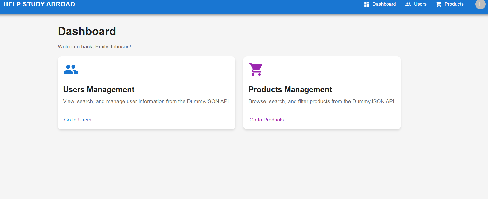
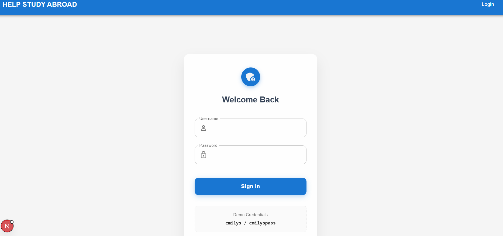
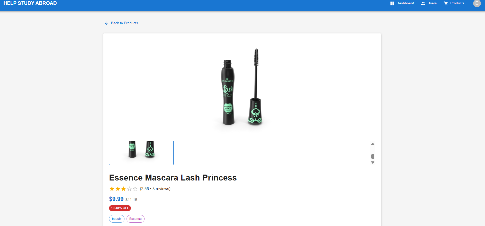
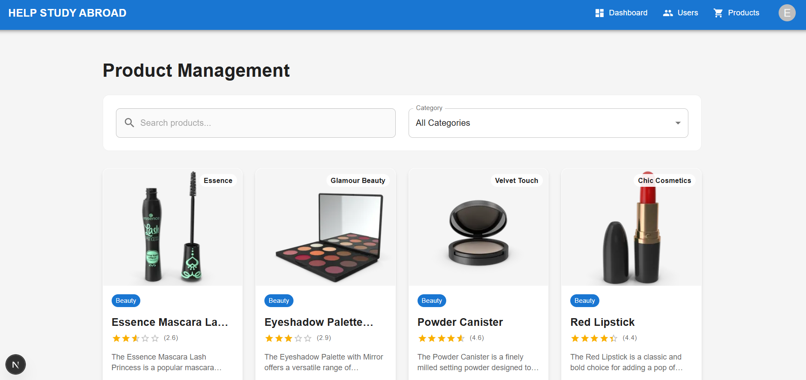
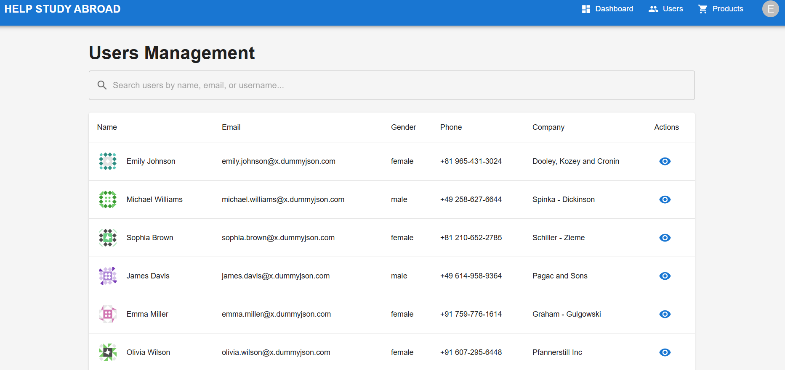
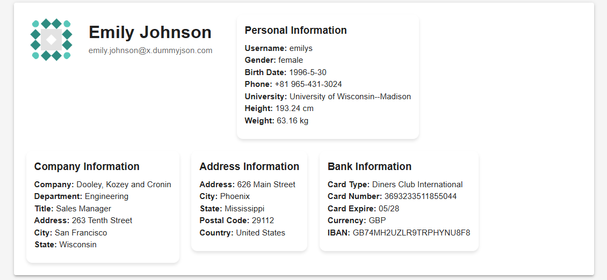

<div align="center">
  <br />
    <h1 align="center">HELP STUDY ABROAD </h1>

<br />

<div>

</div>

</div>


## <a name="introduction">✨ Introduction</a>
A modern, responsive web application built with **Next.js**, **Material-UI**, **Zustand**, and **NextAuth.js**, integrating with the **DummyJSON REST API**.


#  

## ⚠️ Development Note

> **Note regarding commit history:**
> I developed the complete web application locally first to establish the core logic, state management, and basic UI functionality. Once the local build was stable, I pushed the components and features sequentially to this repository.  This approach ensured a clean architecture before syncing with version control.

## 🚧 Current Status

**Active Development:**
I am currently working on **UI improvements for the Product Page** to enhance the visual design, user experience and larger number of products.


## 📋 Table of Contents
- [Features](#features)
- [Tech Stack](#tech-stack)
- [Why Zustand?](#why-zustand)
- [Caching Strategy](#caching-strategy)
- [Setup Instructions](#setup-instructions)

---

## ✨ Features

-  **Authentication System** Secure login implementation using NextAuth.js and Zustand for state syncing.
-  **User Management** Complete user directories with pagination, search functionality, and detailed profile views.
-  **Product Management** Browse products with category filtering, real-time search, and server-side pagination.
-  **Modern UI** Polished interface using Material-UI (MUI) components with a consistent design system.
-  **Fully Responsive** Adaptive design optimized for mobile, tablet, and desktop viewports.
-  **Performance Optimized** Utilizes `React.memo`, `useCallback`, and `useMemo` to prevent unnecessary re-renders.
-  **Client-side Caching** Intelligent state persistence to minimize network requests.
-  **Protected Routes** Middleware protection to ensure only authenticated users access restricted content.

---

## 🛠️ Tech Stack

| Category | Technology |
|----------|------------|
| **Framework** | Next.js 14 (App Router) |
| **UI Library** | Material-UI (MUI) |
| **State Management** | Zustand |
| **Authentication** | NextAuth.js |
| **Language** | TypeScript |
| **HTTP Client** | Axios |
| **Forms** | React Hook Form |

---

## 🧠 Why Zustand?

Zustand was chosen as the state management solution for this project due to:

1.  **Simplicity** — Minimal boilerplate compared to Redux context switching.
2.  **Small Footprint** — Tiny bundle size (1-2KB gzipped).
3.  **Built-in Async Actions** — No middleware (like Thunk/Saga) needed for async operations.
4.  **React Hooks Based** — Natural integration with React's functional component model.
5.  **Persistence Support** — Easy client-side caching with built-in middleware.
6.  **TypeScript Support** — Excellent type inference out of the box.
7.  **DevTools** — Built-in debugging capabilities for state tracking.

> For a small-to-medium application like this, Zustand provides the perfect balance of simplicity and power without the overhead of Redux.

---

## 🚀 Caching Strategy

To optimize performance and reduce API load, we implemented client-side caching using:

1.  **Zustand Persist Middleware**: Automatically syncs critical state (like auth tokens/preferences) to `localStorage`.
2.  **API Response Caching**: Zustand stores keep fetched data (Users/Products) in memory.
3.  **Stale Data Prevention**: The logic checks if data exists in the store before making a network request, ensuring we only fetch when data is stale or missing.

**Benefits:**
* 🚀 Faster page loads
* 📉 Reduced API calls
* ✨ Better user experience (instant navigation)
* 🔌 Offline capability for previously viewed data

---

## ⚙️ Setup Instructions

### Prerequisites
- **Node.js 18+** installed
- **npm** or **yarn** package manager

### Installation

1.  **Clone the repository:**
    ```bash
    git clone <repository-url>
    https://github.com/Amit-yadav099/HelpStudyAbroadWok.git
    ```

2.  **Install dependencies:**
    ```bash
    npm install
    # or
    yarn install
    ```

3.  **Setup Environment Variables:**
    Create a `.env.local` file in the root directory and add the necessary variables :
    ```env
    NEXTAUTH_URL=http://localhost:3000
    NEXTAUTH_SECRET=your_super_secret_key
    ```

4.  **Run the development server:**
    ```bash
    npm run dev
    # or
    yarn dev
    ```

5.  **Open the app:**
    Navigate to [http://localhost:3000](http://localhost:3000) to view the application.


## <a name="Images">Sample Images</a>







